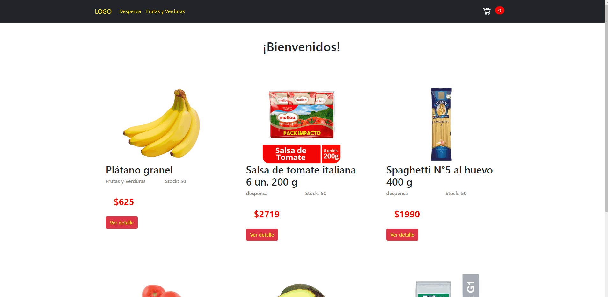

# Tienda de cursos

Catálogo de cursos disponibles relacionados en el Front End

El usuario puede hacer lo siguiente:

 - Navegar por el sitio
 - Ver el detalle de los productos
 - Agregar productos al carrito
 - Eliminar productos del carrito
 - Ir al checkout de la tienda

#

Al finalizar la compra el carrito se vaciará, y el usuario tendrá la posibilidad de volver al home para seguir realizando una nueva compra o vitrinear en la web.

#

### Consideraciones

 - No se validaron los campos de los inputs
 - La data se envía y se registra como un nuevo documento de la colección 'compra' a Firebase pero no se visualiza por consola

#

### Gif de la navegación del sitio

